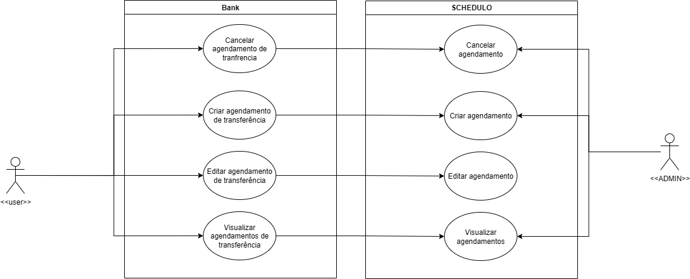
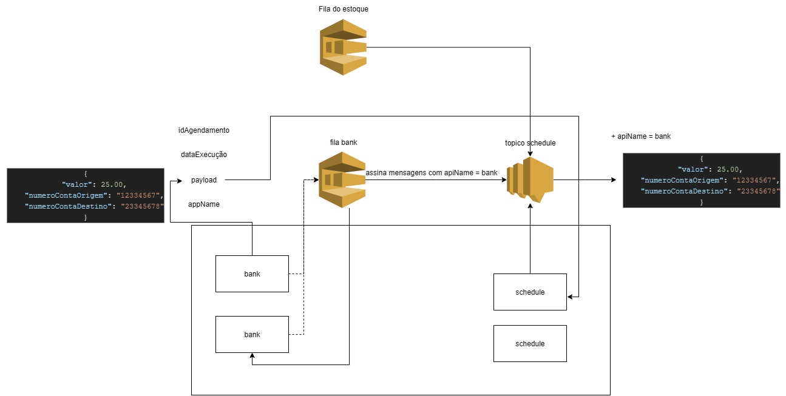

# Bank Isabela — API REST para Sistemas Bancários

🚧 **Status:** Em andamento (integração com [Schedule](https://github.com/Isabela01vSilva/schedule) em desenvolvimento)

---

Projeto para gerenciamento de clientes, contas bancárias e operações financeiras, pensado para oferecer uma API REST completa para sistemas bancários.

Este sistema permite o cadastro, consulta, atualização e exclusão de clientes e contas, além de operações como depósitos, saques, transferências e consulta de saldo.

---

### Funcionalidades principais

- CRUD de clientes e contas bancárias  
- Depósitos, saques e transferências imediatas  
- Consulta de saldo e extratos  
- Integração futura com o microserviço **Schedule** para agendamento de transferências

---

📌 *Os diagramas abaixo estão em versão preliminar e serão atualizados conforme o desenvolvimento do projeto.*

#### Diagrama de Uso   

#### Diagrama de Arquitetura  

---

### Integração com Schedule

O [Schedule](https://github.com/Isabela01vSilva/schedule) é um microserviço complementar responsável pelo agendamento de transferências bancárias futuras. Ele foi desenvolvido para funcionar de forma desacoplada, permitindo que o Bank se concentre nas operações imediatas, enquanto o Schedule cuida do processamento agendado.

- Comunicação via API REST utilizando `WebClient` do Spring Boot  
- Integração ainda em fase de desenvolvimento

---

### Tecnologias usadas

- Java 21  
- Spring Boot  
- Spring Data JPA  
- MySQL   
- Maven  

---

## Autor

[Isabela Silva](https://www.linkedin.com/in/isabela01vsilva)
