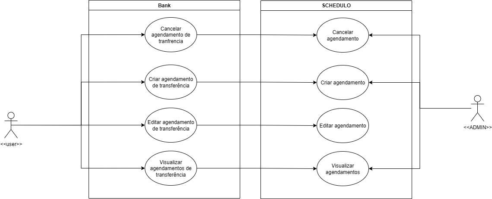
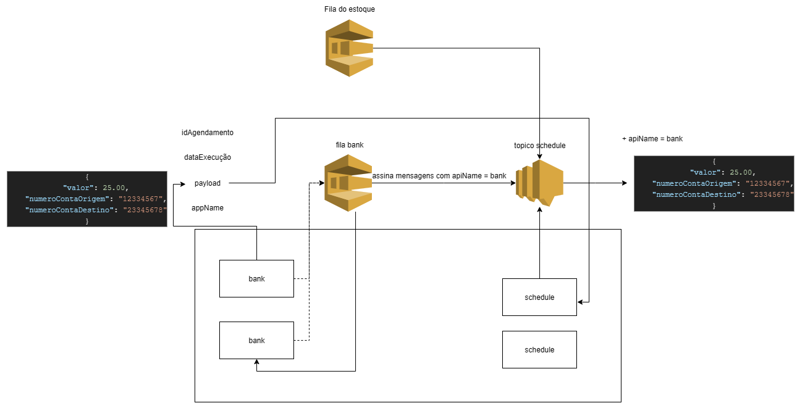

# Bank Isabela — API REST Sistema Bancário + Controle Financeiro

🚧 **Status:** Em desenvolvimento

---

API REST desenvolvida com Java e Spring Boot para simular operações de uma instituição financeira digital. O projeto tem como objetivo aplicar conceitos de arquitetura de software, regras de negócio bancárias, controle financeiro e integração entre serviços.

Além das operações bancárias tradicionais, o sistema possui foco em análise financeira, permitindo que clientes acompanhem entradas, saídas, economia e evolução patrimonial através de dashboards e indicadores.

---

## Objetivo do Projeto

O Bank Isabela foi criado como um projeto de portfólio para demonstrar conhecimentos em:

- Java
- Spring Boot
- APIs REST
- JPA/Hibernate
- Modelagem de Dados
- Arquitetura em Camadas
- Regras de Negócio
- Integração entre Microserviços
- Angular
- AWS

---

### Tecnologias usadas

- Java 21
- Spring Boot
- Spring Data JPA
- Spring Security
- Spring Web
- Spring Validation
- Hibernate
- WebClient
- APIs REST
- Git
- Git Hub
- Postman
- MySQL
- Maven

---

## Funcionalidades

### Cliente

- Cadastro de clientes
- Consulta de clientes
- Atualização de dados cadastrais
- Validação de CPF, e-mail e telefone

### Conta Bancária

- Conta Corrente
- Conta Poupança
- Criação automática de contas
- Consulta de saldo
- Ativação e desativação de contas

### Movimentações

- Depósitos
- Saques
- Histórico de movimentações
- Geração de boletos para depósito
- Geração de boletos para saque

### Dashboard Financeiro

- Resumo financeiro
- Entradas do mês
- Saídas do mês
- Economia acumulada
- Comparativos mensais
- Evolução financeira

### Funcionalidades Futuras

- Transferências entre contas
- Agendamento de transferências
- Cartão de crédito
- Controle de gastos por categoria
- Dashboard avançado
- Integração com microserviços

---

## Roadmap

### ✅ [Fase 1 - Core Bancário](docs/requisitos/fase-1-core-bancario.md) - Em desenvolvimento

- Cadastro de clientes
- Gestão de contas
- Depósitos
- Saques
- Histórico de movimentações

### 🚧 Fase 2 - Dashboard Financeiro

- Indicadores financeiros
- Evolução patrimonial
- Controle de gastos

### 📅 Fase 3 - Boletos

- Boletos para depósito
- Boletos para saque
- Controle de saldo bloqueado

### 📅 Fase 4 - Transferências

- Transferências entre contas
- Histórico de transferências

### 📅 Fase 5 - Agendamentos

- Agendamento de transferências
- Scheduler Implementado
- Processamento automático

### 📅 Fase 6 - Cartão de Crédito

- Compras
- Limites
- Fatura
- Análise de gastos

---

📌 *Os diagramas abaixo estão em versão preliminar e serão atualizados conforme o desenvolvimento do projeto.*

#### Diagrama de Uso


#### Diagrama de Arquitetura


---


### Integração com Schedule

O [Schedule](https://github.com/Isabela01vSilva/schedule) é um microserviço complementar responsável pelo agendamento de transferências bancárias futuras. Ele foi desenvolvido para funcionar de forma desacoplada, permitindo que o Bank se concentre nas operações imediatas, enquanto o Schedule cuida do processamento agendado.

- Comunicação via API REST utilizando `WebClient` do Spring Boot  
- Integração ainda em fase de desenvolvimento

---

## 📚 Documentação

A documentação do projeto está organizada na pasta `docs/`:

```text
docs/
│
├── diagrama-arquitetura.png
├── diagrama-uso.png
│
├── visao-produto.md
├── roadmap.md
├── arquitetura.md
├── modelo-dados.md
├── regras-negocio.md
│
└── requisitos/
    ├── fase-1-core-bancario.md
    ├── fase-2-dashboard.md
    ├── fase-3-boletos.md
    ├── fase-4-transferencias.md
    ├── fase-5-agendamentos.md
    └── fase-6-cartao-credito.md
```

---

## Como Executar o Projeto

```bash
git clone <repositorio>

cd bank-isabela

mvn clean install

mvn spring-boot:run
```

---
